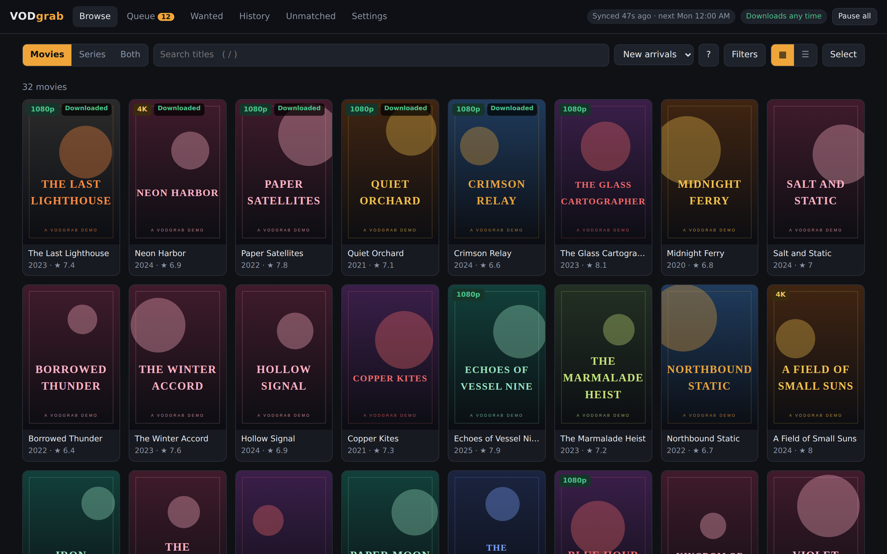
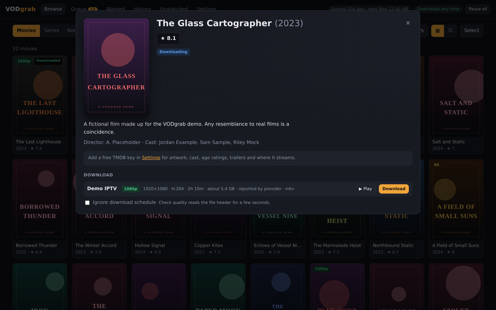
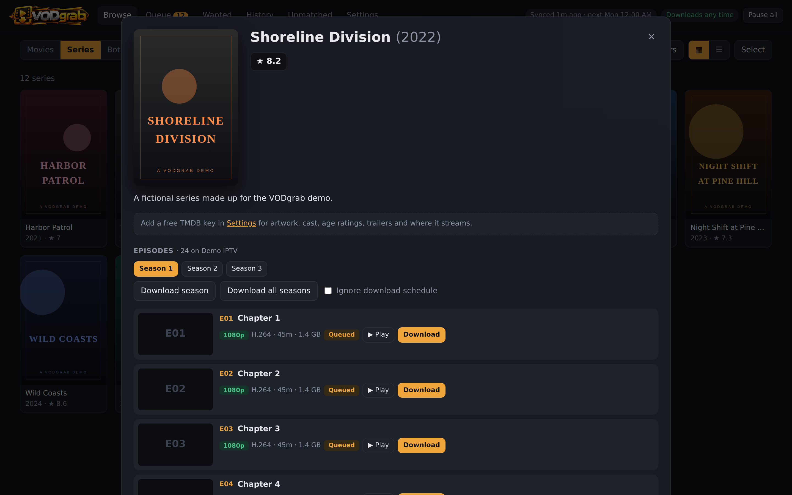
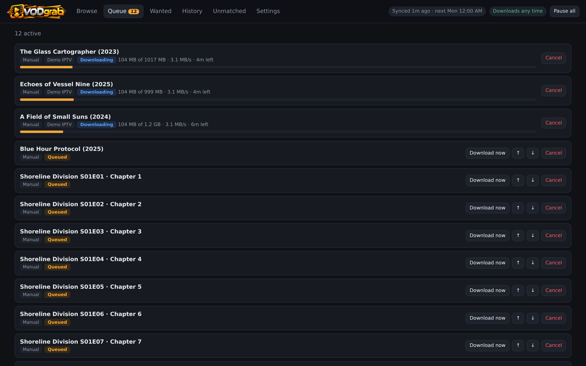
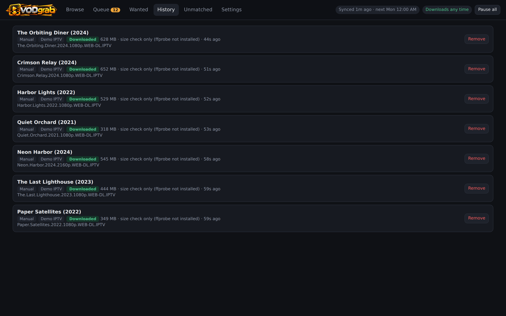
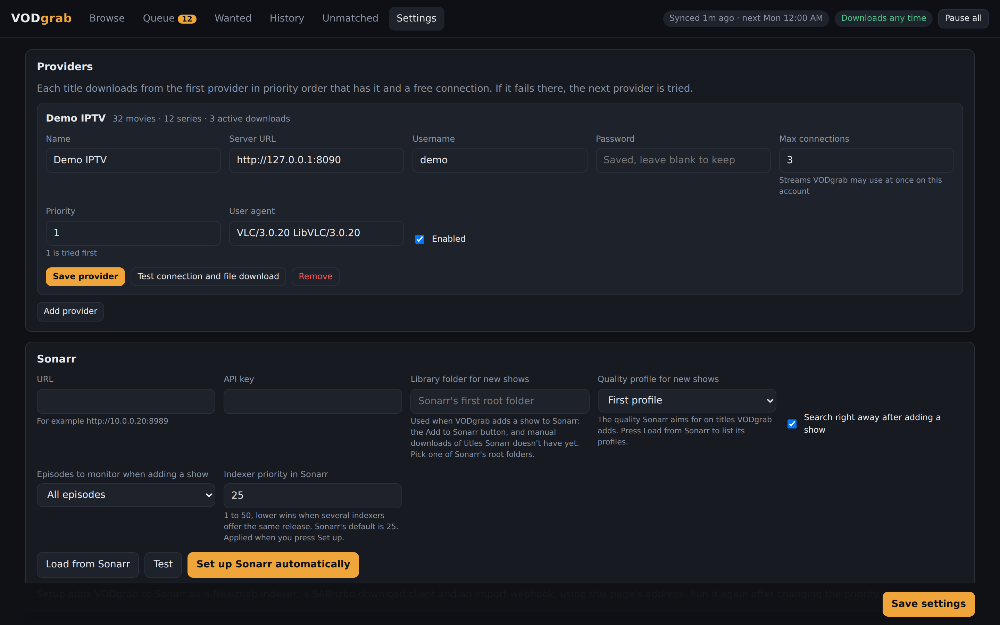

<div align="center">


**Turn your Xtream IPTV VOD library into real video files for Sonarr and Radarr.**

[](https://github.com/Deekerman/VODgrab/actions/workflows/docker.yml)




</div>

VODgrab sits between your IPTV provider and your *arr stack. Sonarr and Radarr see it as a normal **Newznab indexer** and **SABnzbd download client**. When they grab a release, VODgrab downloads the matching movie or episode from your provider, checks the file, and hands it back for import. You can also browse the whole catalog in VODgrab's own web UI and download from there.

It is a single Python file with no dependencies outside the standard library. Run it with [Docker Compose](#quick-start-docker-compose) or [just the Python file](#install-with-just-the-python-file).

It is VERY important to note, this was made entirely by AI.

## Features

- **Works with Sonarr and Radarr as they are.** It acts as a Newznab indexer and a SABnzbd API, with one-click setup that adds itself to both apps.
- **Catalog browser.** Posters, ratings, quality badges, filters, search, and movie and series detail pages with per-episode downloads.
- **Wanted list.** Shows what Sonarr and Radarr are missing that your provider has, and can search for it automatically.
- **Multiple providers.** Set a priority order and connection limits. If a download fails on one provider, the next one is tried.
- **Reliable downloads.** Resumes interrupted transfers, retries with backoff, has a speed limit, and checks files with ffprobe.
- **Download schedule.** Only download during the time windows you set, with pause and resume.
- **Metadata.** Optional TMDB, OMDb and TVDB keys add artwork, cast, age ratings and better matching.
- **Unmatched review.** Fix titles VODgrab couldn't match yourself, and the fix is remembered.
- **Backups.** Scheduled backups of settings, metadata and the catalog, with restore from the UI.
- **Sync change lists.** See exactly which titles each catalog sync added or removed, and download the list.
- **Dispatcharr.** Download through Dispatcharr, so it enforces connection limits shared with live TV, or import its Xtream accounts as providers.
- **Fix wrong matches.** Unlink a title from the wrong Radarr movie, or link it to the right one.
- **In-app updates.** Get notified of new versions, with release notes and one-click updating for Python-file installs.
- **Web login** and a SABnzbd-style API key.

## Screenshots

| Movie details | Series and episodes |
| :---: | :---: |
|  |  |
| **Download queue** | **History** |
|  |  |
| **Settings** | |
|  | |

<sub>Screenshots use a fake demo provider with made-up titles.</sub>

## Quick start (Docker Compose)

```yaml
services:
  vodgrab:
    image: ghcr.io/deekerman/vodgrab:latest
    container_name: vodgrab
    restart: unless-stopped
    ports:
      - "8765:8765"
    environment:
      - PUID=1000
      - PGID=1000
      - TZ=America/Toronto
    volumes:
      - ./data:/data
      - /path/to/downloads:/downloads
```

```sh
docker compose up -d
```

Open **http://&lt;host&gt;:8765**, add your provider under **Settings → Providers**, and run a sync.

To build the image from source instead, clone this repo and run `docker compose up -d --build`.

### Volumes

| Container path | Purpose |
| --- | --- |
| `/data` | Database, settings, metadata cache and backups. Keep this. |
| `/downloads` | Downloads go to `/downloads/iptv` by default (the **Base path** setting). |

> [!IMPORTANT]
> **Sonarr and Radarr must see the downloads at the same path VODgrab does.** Mount the same host folder at `/downloads` in all three containers. Then no remote path mapping is needed, and imports work.

### Environment

| Variable | Default | Purpose |
| --- | --- | --- |
| `PUID` / `PGID` | `1000` | User and group VODgrab runs as. Match Sonarr and Radarr. Use `0` to run as root. |
| `TZ` | UTC | Time zone for schedules and logs. |
| `VODGRAB_DATA` | `/data` | Data directory inside the container. |

On start, the container sets `/data` to be owned by `PUID:PGID`. If `/downloads/iptv` doesn't exist yet, it creates that folder too. Nothing else under `/downloads` is changed.

### Full stack example

```yaml
services:
  vodgrab:
    image: ghcr.io/deekerman/vodgrab:latest
    restart: unless-stopped
    ports: ["8765:8765"]
    environment: [PUID=1000, PGID=1000, TZ=America/Toronto]
    volumes:
      - ./vodgrab:/data
      - /srv/media/downloads:/downloads

  sonarr:
    image: lscr.io/linuxserver/sonarr:latest
    restart: unless-stopped
    ports: ["8989:8989"]
    environment: [PUID=1000, PGID=1000, TZ=America/Toronto]
    volumes:
      - ./sonarr:/config
      - /srv/media/downloads:/downloads
      - /srv/media/tv:/tv

  radarr:
    image: lscr.io/linuxserver/radarr:latest
    restart: unless-stopped
    ports: ["7878:7878"]
    environment: [PUID=1000, PGID=1000, TZ=America/Toronto]
    volumes:
      - ./radarr:/config
      - /srv/media/downloads:/downloads
      - /srv/media/movies:/movies
```

## Connecting Sonarr and Radarr

1. In VODgrab, open **Settings**. Enter the Sonarr URL (`http://sonarr:8989` on the same compose network) and its API key, and do the same for Radarr (`http://radarr:7878`).
2. Press **Set up Sonarr automatically** and **Set up Radarr automatically**. This adds VODgrab to each app as an indexer, a download client, and an import webhook.
3. Search in Sonarr or Radarr as usual. Releases from your provider have names ending in `.IPTV`, like `Movie.Name.2023.1080p.WEB-DL.IPTV`.

To add VODgrab by hand instead: in Sonarr or Radarr, add a **Newznab** indexer and a **SABnzbd** download client, both with host `vodgrab`, port `8765`, and the API key shown in VODgrab's settings.

## Dispatcharr

If you use [Dispatcharr](https://github.com/Dispatcharr/Dispatcharr), open **Settings → Dispatcharr**, enter its address (for example `http://dispatcharr:9191`) and an API key (in Dispatcharr: Users, edit your user, API key), and press **Connect**. Then tick how you want to use it and press **Apply**:

- **Download through Dispatcharr:** VODgrab adds Dispatcharr as one provider and downloads through its Xtream output, logged in as your Dispatcharr user. Dispatcharr spreads the downloads over your logins and counts them together with live TV. Your Dispatcharr user needs an XC password, and VOD has to be turned on for the accounts in Dispatcharr.
- **Import Dispatcharr's Xtream logins as providers:** every active profile becomes its own provider with its own stream limit. For example, one account with two 5-stream profiles gives VODgrab 10 streams. Passwords come from Dispatcharr once it has refreshed the account, so you only type one if it doesn't have it yet. They are kept up to date before each sync.

With **Download through Dispatcharr** on, a movie's details list every provider copy Dispatcharr has (from its native API). You can let Dispatcharr pick, or choose the provider for that download.

Untick either one and press **Apply** to switch its providers off. They are kept, so ticking it again brings them back.

## Fixing a wrong match

If VODgrab links a title to the wrong Radarr movie (for example *Snow White* (2025) vs *Snow White and the Seven Dwarfs*), open the title. Under **Linked in Radarr**, press **Not this movie** to unlink it, or **Link to a different movie** to pick the right one from your Radarr library. VODgrab remembers this, and from then on offers the title to Radarr and lists it on Wanted only for the movie you chose. For titles with no match at all, use the **Unmatched** page.

## Install with just the Python file

VODgrab is one file with no dependencies, so you can skip Docker. You need Python 3.8 or newer. Installing `ffmpeg` is recommended, so downloads get checked with ffprobe.

```sh
# 1. Get the script
sudo mkdir -p /opt/vodgrab
sudo curl -fsSL -o /opt/vodgrab/vodgrab.py \
  https://raw.githubusercontent.com/Deekerman/VODgrab/main/vodgrab.py

# 2. Optional but recommended: ffprobe for download checks
sudo apt install ffmpeg        # Debian/Ubuntu; use your distro's package manager otherwise

# 3. Install and start it as a systemd service
sudo python3 /opt/vodgrab/vodgrab.py install
```

Open **http://&lt;host&gt;:8765**. The service starts at boot and restarts if it crashes.

To try it without installing a service, run it in the foreground:

```sh
python3 vodgrab.py serve               # web UI, indexer and download API (Ctrl+C to stop)
python3 vodgrab.py serve --port 9000   # on a different port
python3 vodgrab.py sync                # run one catalog sync and exit
```

Data (database, settings, backups) is stored in a `data` folder next to the script, `/opt/vodgrab/data` in the example above. Set `VODGRAB_DATA` to store it somewhere else.

**Updating:** open **Settings → Updates** and press **Update now**. VODgrab downloads the new version, keeps the old one as `vodgrab.py.bak`, and restarts itself. Downloads in progress pick up where they left off. To update by hand instead, download the file again over the old one, then restart:

```sh
sudo curl -fsSL -o /opt/vodgrab/vodgrab.py \
  https://raw.githubusercontent.com/Deekerman/VODgrab/main/vodgrab.py
sudo systemctl restart vodgrab
```

**Logs:** `journalctl -u vodgrab -f`, or **Settings → Log → Download all logs**. Log files are kept in `data/logs/`.

> [!NOTE]
> The service runs as root. Set **Owner for new files** (for example `1000:1000`) in VODgrab's settings so Sonarr and Radarr can move the downloaded files.

## Updating (Docker)

```sh
docker compose pull && docker compose up -d
```

Your settings and catalog live in `/data`, so updating keeps them. **Settings → Updates** tells you when a new version is out and what changed (see [CHANGELOG.md](CHANGELOG.md)).

## Disclaimer

VODgrab is a download tool for content you're entitled to access. It doesn't include or point to any provider or content. You're responsible for complying with your provider's terms and the laws where you live.
